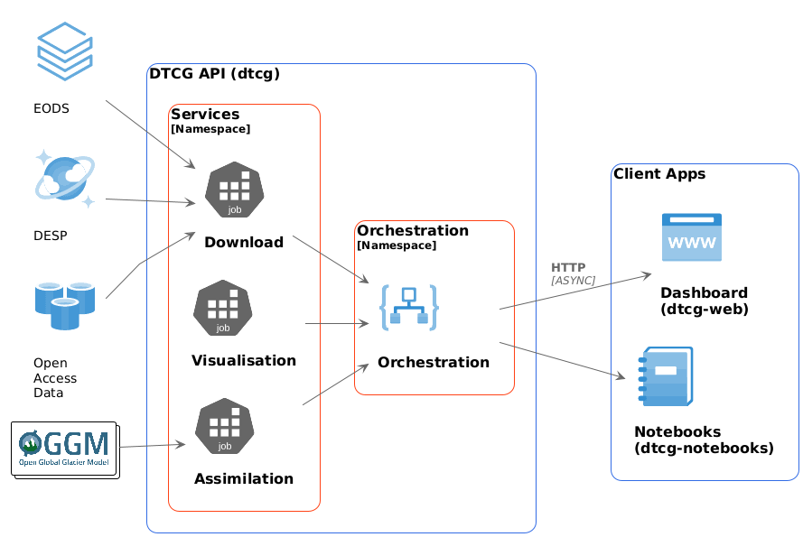

.. dtcg documentation master file, created by
   sphinx-quickstart on Mon Nov  3 11:46:49 2025.
   You can adapt this file completely to your liking, but it should at least
   contain the root `toctree` directive.
.. _index:

Digital Twin Component for Glaciers API
=======================================

The **DTC Glaciers project (DTCG)** is developed for the European Space Agency’s Digital Twin Earth initiative, as part of the `Digital Twin Components Early Development Actions <https://eof.esa.int/early-dtc/>`__.
This **DTCG API** is the bedrock for all `DTCG components <https://dtcglaciers.org/>`__, connecting the `DestinE Platform <https://platform.destine.eu/>`__ and external data providers to cutting-edge glacier models like `OGGM <https://oggm.org/>`__, to produce dynamic digital representations of mountain glaciers.

The digital twin is designed to be explored, interrogated, and informed in response to real-world events, new observations, and evolving scenarios.
This open and interactive platform will empower users and stakeholders to better understand the rapid changes in mountain glaciers and take informed action to address these challenges effectively.

   

.. toctree::
   :maxdepth: 3
   :caption: Installation

   installation

.. toctree::
   :maxdepth: 3
   :caption: API Reference

   api
